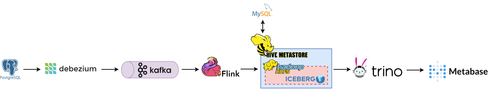

# CDC Lakehouse PoC

This project is a Proof of Concept (PoC) demonstrating a data architecture to load data from an RDBMS database into a lakehouse and utilize it for Business Intelligence (BI) purposes.

**Note:** This PoC does **not** include fault tolerance or security best practices. It is intended for learning and experimentation.


## 📌 Architecture Diagram
The data flow in this architecture is as follows:

PostgreSQL DB (as CDC source) -> Debezium -> Kafka -> FlinkSQL -> HDFS (Iceberg) via Hive Metastore (using MySQL) -> Query via Trino -> BI using Metabase

 


### 🛠️ Technologies Used

* **PostgreSQL (v16):** Relational database management system.
* **Debezium (v2.7.4):** Open-source distributed platform for change data capture.
* **Apache Kafka (v3.9):** Distributed streaming platform.
* **Apache Flink (v1.19.1):** Stream processing framework with SQL interface.
* **Apache Hadoop HDFS (v3.2.1):** Distributed file system.
* **Apache Iceberg (v1.7):** Open table format for massive analytic datasets.
* **Apache Hive Metastore (v3.1.3):** Metadata repository for Hadoop and other data processing systems.
* **Trino (v435):** Distributed SQL query engine for big data analytics.
* **Metabase (v0.54.6.2):** Open-source business intelligence and analytics tool.
* **Docker Compose:** Tool for defining and managing multi-container Docker applications.


# 🧱 Docker Compose Components

The `docker-compose.yml` file includes the following services:


###  **Kafka Stack (Confluent)**
- **broker**: Kafka broker for message streaming.
- **schema-registry**: Manages Kafka message schemas.
- **connect**: Kafka Connect with Debezium connector for change data capture (CDC).
- **control-center**: Kafka UI for monitoring and managing the Kafka ecosystem.

###  **Apache Flink**
- **flink-sql-client**: Command-line interface (CLI) for executing Flink SQL queries.
- **flink-jobmanager**: Manages the execution of Flink jobs.
- **flink-taskmanager**: Executes tasks for Flink jobs.

### 🗄️ **Hadoop HDFS**
- **namenode**: The master node of HDFS that manages the file system metadata.
- **datanode**: Stores the actual data blocks in HDFS.

###   **Databases**
- **postgres**: The source PostgreSQL database used for change data capture (CDC).
- **hive-metastore-db**: MySQL database used by Hive for storing metadata.
- **hive-metastore**: The Hive metastore service that manages metadata for tables stored in HDFS (Iceberg).

###  **Query Engine**

- **trino-coordinator**: Coordinates and optimizes Trino SQL queries.
- **trino-worker**: Executes queries provided by the coordinator in a distributed fashion.

### 📊 **BI Tool**

- **metabase**: A business intelligence tool for visualizing data and creating interactive dashboards.


## 🌐 Web UIs

The following web UIs are available for monitoring and interacting with the project components:

| Component      | URL                             |
|----------------|----------------------------------|
| Kafka          | [http://localhost:9021](http://localhost:9021) |
| Flink          | [http://localhost:9081](http://localhost:9081) |
| HDFS           | [http://localhost:9870](http://localhost:9870) |
| Trino          | [http://localhost:8080](http://localhost:8080) |
| Metabase       | [http://localhost:3000](http://localhost:3000) |

## 🚀 Startup Steps

Follow these steps to set up and run the PoC:

### Step #1  **Start Docker Compose:**
    
```bash
docker compose up -d
```

### Step #2  **Create PostgreSQL Tables:**
 Connect to the PostgreSQL database using any client and execute the following SQL commands under the default postgres database and public schema:


```sql
CREATE TABLE orders (
    order_id SERIAL PRIMARY KEY,
    customer_id INTEGER NOT NULL,
    order_date TIMESTAMP WITH TIME ZONE NOT NULL,
    total_amount DECIMAL(10, 2) NOT NULL,
    order_status VARCHAR(50) NOT NULL
);

CREATE TABLE customers (
    customer_id SERIAL PRIMARY KEY,
    first_name VARCHAR(100) NOT NULL,
    last_name VARCHAR(100) NOT NULL,
    email VARCHAR(255) UNIQUE,
    registration_date TIMESTAMP WITH TIME ZONE NOT NULL
);

INSERT INTO orders (customer_id, order_date, total_amount, order_status) VALUES
(1, NOW(), 125.50, 'PROCESSING'),
(2, NOW() - INTERVAL '1 day', 78.99, 'SHIPPED'),
(1, NOW() - INTERVAL '2 hours', 200.00, 'PROCESSING'),
(3, NOW() - INTERVAL '3 days', 45.20, 'DELIVERED'),
(4, NOW() - INTERVAL '1 hour', 59.99, 'PROCESSING'),
(5, NOW() - INTERVAL '12 hours', 130.25, 'SHIPPED'),
(6, NOW() - INTERVAL '1 day', 89.50, 'DELIVERED'),
(4, NOW() - INTERVAL '5 days', 75.00, 'CANCELLED'),
(7, NOW() - INTERVAL '3 days', 210.00, 'PROCESSING'),
(5, NOW() - INTERVAL '2 days', 320.75, 'DELIVERED'),
(2, NOW() - INTERVAL '6 hours', 49.90, 'PROCESSING'),
(3, NOW() - INTERVAL '4 days', 99.95, 'RETURNED'),
(1, NOW() - INTERVAL '10 days', 149.99, 'SHIPPED');

INSERT INTO customers (first_name, last_name, email, registration_date) VALUES
('Alice', 'Smith', 'alice.smith@example.com', NOW() - INTERVAL '7 days'),
('Bob', 'Johnson', 'bob.johnson@example.com', NOW() - INTERVAL '10 days'),
('Charlie', 'Brown', 'charlie.brown@example.com', NOW() - INTERVAL '5 days'),
('Diana', 'Prince', 'diana.prince@example.com', NOW() - INTERVAL '12 days'),
('Ethan', 'Hunt', 'ethan.hunt@example.com', NOW() - INTERVAL '3 days'),
('Fiona', 'Gallagher', 'fiona.gallagher@example.com', NOW() - INTERVAL '15 days'),
('George', 'Martin', 'george.martin@example.com', NOW() - INTERVAL '20 days'),
('Hannah', 'Lee', 'hannah.lee@example.com', NOW() - INTERVAL '2 days'),
('Ivan', 'Petrov', 'ivan.petrov@example.com', NOW() - INTERVAL '8 days'),
('Julia', 'Roberts', 'julia.roberts@example.com', NOW() - INTERVAL '6 days');

ALTER TABLE orders REPLICA IDENTITY FULL;
ALTER TABLE customers REPLICA IDENTITY FULL;
```

### Step #3  **Create Kafka Connection (Debezium Connector):**
1. Open the Kafka Connect UI: [http://localhost:9021/clusters/MkU3OEVBNTcwNTJENDM2Qk/management/connect/connect-default/connectors](http://localhost:9021/clusters/MkU3OEVBNTcwNTJENDM2Qk/management/connect/connect-default/connectors)
2. Click on "Add new connector".
3. Select the file located at `config/kafka/debezium_postgres.json` to configure the PostgreSQL Debezium connector.
4. **Verification:** Open the Kafka Topics UI. You should see two new topics: `debezium.public.customers` and `debezium.public.orders`.

### Step #4  **Create Flink Tables and Transformations:**
1.  Connect to the Flink SQL client:
        
```bash
docker compose exec -it flink-sql-client bash -c "sql-client.sh"
```


2.  Create the raw stream tables for the orders and customers Kafka topics:
        
```sql
CREATE TABLE OrdersRaw (
    order_id BIGINT,
    customer_id INTEGER,
    order_date TIMESTAMP_LTZ(3),
    total_amount DECIMAL(10, 2),
    order_status VARCHAR,
    PRIMARY KEY (order_id) NOT ENFORCED
) WITH (
    'connector' = 'kafka',
    'topic' = 'debezium.public.orders',
    'properties.bootstrap.servers' = 'broker:29092',
    'properties.client.dns.lookup' = 'use_all_dns_ips',
    'scan.startup.mode' = 'earliest-offset',
    'key.format' = 'json',
    'key.json.ignore-parse-errors' = 'true',
    'key.fields' = 'order_id',
    'value.format' = 'debezium-json',
    'value.debezium-json.ignore-parse-errors' = 'true',
    'value.debezium-json.timestamp-format.standard' = 'ISO-8601'
);

CREATE TABLE CustomersRaw (
    customer_id INTEGER,
    first_name VARCHAR,
    last_name VARCHAR,
    email VARCHAR,
    registration_date TIMESTAMP_LTZ(3),
    PRIMARY KEY (customer_id) NOT ENFORCED
) WITH (
    'connector' = 'kafka',
    'topic' = 'debezium.public.customers',
    'properties.bootstrap.servers' = 'broker:29092',
    'properties.client.dns.lookup' = 'use_all_dns_ips',
    'scan.startup.mode' = 'earliest-offset',
    'key.format' = 'json',
    'key.json.ignore-parse-errors' = 'true',
    'key.fields' = 'customer_id',
    'value.format' = 'debezium-json',
    'value.debezium-json.ignore-parse-errors' = 'true',
    'value.debezium-json.timestamp-format.standard' = 'ISO-8601'
);
```


3.  **Verification:** Execute the following queries in the Flink SQL client to verify data ingestion from Kafka:
        

``` sql
SELECT * FROM OrdersRaw;
SELECT * FROM CustomersRaw;
```

4.  Create the Hive catalog and database for Iceberg:
        
```sql
CREATE CATALOG hive_catalog WITH (
    'type'='iceberg',
    'catalog-type'='hive',
    'uri'='thrift://hive-metastore:9083',
    'clients'='5',
    'property-version'='1',
    'warehouse'='hdfs://namenode:9000/warehouse'
);
USE CATALOG hive_catalog;
CREATE DATABASE iceberg_db;
USE iceberg_db;
```

5.  Create the Iceberg tables:
        
```sql
CREATE TABLE OrdersIceberg
(
    order_id BIGINT,
    customer_id INTEGER,
    order_date TIMESTAMP_LTZ(3),
    total_amount DECIMAL(10, 2),
    order_status VARCHAR,
    PRIMARY KEY (order_id) NOT ENFORCED
) WITH (
    'format-version' = '2',
    'write.upsert.enabled' = 'true'
);

CREATE TABLE CustomersIceberg
(
    customer_id INTEGER,
    first_name VARCHAR,
    last_name VARCHAR,
    email VARCHAR,
    registration_date TIMESTAMP_LTZ(3),
    PRIMARY KEY (customer_id) NOT ENFORCED 
) WITH (
    'format-version' = '2',
    'write.upsert.enabled' = 'true'
);

CREATE TABLE EnrichedOrdersIceberg (
    order_id BIGINT,
    customer_id INTEGER,
    order_date TIMESTAMP_LTZ(3),
    total_amount DECIMAL(10, 2),
    order_status VARCHAR,
    customer_first_name VARCHAR,
    customer_last_name VARCHAR,
    PRIMARY KEY (order_id) NOT ENFORCED
) WITH (
    'format-version' = '2',
    'write.upsert.enabled' = 'true'
);
```

6.  **Verification:** Open the HDFS UI ([http://localhost:9870/explorer.html#/warehouse/iceberg_db.db](http://localhost:9870/explorer.html#/warehouse/iceberg_db.db)) to see the metadata files for the iceberg_db.

7.  Apply some Flink configurations:
        
```sql
SET 'execution.checkpointing.interval' = '10s';
SET 'table.exec.sink.upsert-materialize' = 'auto';
SET 'table.exec.iceberg.emit.snapshot-empty' = 'false';
```

8.  Run Flink jobs to populate the Iceberg tables from the Kafka streams:
        
```sql
INSERT INTO hive_catalog.iceberg_db.OrdersIceberg 
SELECT * FROM default_catalog.default_database.OrdersRaw;

INSERT INTO hive_catalog.iceberg_db.CustomersIceberg 
SELECT * FROM default_catalog.default_database.CustomersRaw;

INSERT INTO hive_catalog.iceberg_db.EnrichedOrdersIceberg
SELECT
    o.order_id,
    o.customer_id,
    o.order_date,
    o.total_amount,
    o.order_status,
    c.first_name,
    c.last_name
FROM default_catalog.default_database.OrdersRaw o
JOIN default_catalog.default_database.CustomersRaw c ON o.customer_id = c.customer_id;
```

9.  **Verification:** Query the new Iceberg tables in the Flink SQL client and open the Flink UI ([http://localhost:9081/](http://localhost:9081/)) to see the running Flink jobs.

### Step #5  **Try Trino:**
Use your favorite JDBC client (e.g., DBeaver) to connect to the Trino coordinator.

* **Connection URL:** jdbc:trino://localhost:8080/iceberg
* **Username:** You can use any value for the username.

Execute queries against the Iceberg tables:
```sql
SELECT * FROM iceberg_db.enrichedordersiceberg;
```


**Verification:** Open the Trino UI ([http://localhost:8080/ui/](http://localhost:8080/ui/)) and navigate to the cluster monitoring section to see the executed queries. You can use any value for the username to access the UI.

### Step #6  **Setup Metabase:**
1. Open the Metabase UI: [http://localhost:3000/](http://localhost:3000/)
2. Follow the UI steps to set up your account.
3. Add a new database connection with the following details for Trino:
    * **Display name:** Trino
    * **Hostname:** trino-coordinator
    * **Port:** 8080
    * **Catalog:** iceberg
    * **Schema:** iceberg_db
    * **Username:** Trino
4. Explore the data and create visualizations using the connected Trino database. You can then create dashboards to analyze the enriched order data.

 

